+++
title = 'Over The Wire (Bandit) - Parte 2'
description = "Los Juegos que ofrece OverTheWire pueden ayudarte a aprender y practicar conceptos de seguridad informatica o conceptos basicos de la terminal de una forma competitiva y divertida."
date = 2025-04-16
categories = [
    "Linux",
    "Bash",
    "Tutorial",
    "Comandos",
]
tags = [
    "Linux",
    "Bash",
    "Comandos",
    "Terminal",
    "Guía",
    "Productividad",
    "Desarrollo",
    "Retos",
]

image = "wallpaper.png"
+++

## Over The Wire (Continuacion)

¡Bienvenidos de nuevo!

En este segundo post, vamos a seguir profundizando en nuestros conocimientos de OverTheWire y avanzar más allá del nivel 10. Si ya descansaron y repasaron lo aprendido en la primera parte, ¡están listos para continuar! Si no han hecho la parte uno, les recomiendo volver a intentarlo. Como mencioné en el post anterior, reforzar lo que ya hemos visto es clave para consolidar nuestros conocimientos.

En esta ocasión, empezaremos con un enfoque más práctico. Si bien los primeros 10 niveles fueron una excelente base, ahora nos enfrentaremos a nuevas técnicas y desafíos que nos pondrán a prueba de maneras diferentes con desafios mas complejos, pero no se preocupen, ¡todo es cuestión de práctica y paciencia!

¡Vamos allá!


### Level 11 -> level 12

Para este nivel nos dice que la contraseña esta siendo rotada en 13 posiciones y para poder entender esto les dare una explicaion acerca del cifrado cesar, ya que asi entenderemos mejor el comando y el funcionamiento del comando que vamos a usar.

#### Cifrado Cesar:

Vamos a cifrar la palabra **"hola"** rotándola 5 posiciones en el alfabeto y así es como lo haremos:

1. Tomamos la palabra **"hola"**.
2. Ubicamos cada letra de la palabra en su posición dentro del alfabeto.
    
3. Comenzamos con la letra **'h'**. En el alfabeto, la **'h'** está en la posición 7 (contando desde la A como 0). Ahora, sumamos 5 posiciones hacia adelante. 
    
    * 7 + 5 = 12, que corresponde a la letra **'m'**.

4. Repetimos este proceso para cada letra:
    * Para la letra **'o'**, que está en la posición 14, sumamos 5
        * 14 + 5 = 19, que es **'t'**.

    * Para la letra **'l'**, que está en la posición 11, sumamos 5: 
        * 11 + 5 = 16, que es **'p'**.

    * Para la letra 'a', que está en la posición 0, sumamos 5: 
        * 0 + 5 = 5, que es **'f'**.

5. Finalmente, al aplicar la rotación de 5 posiciones, la palabra "hola" se convierte en **"mtpf"**.

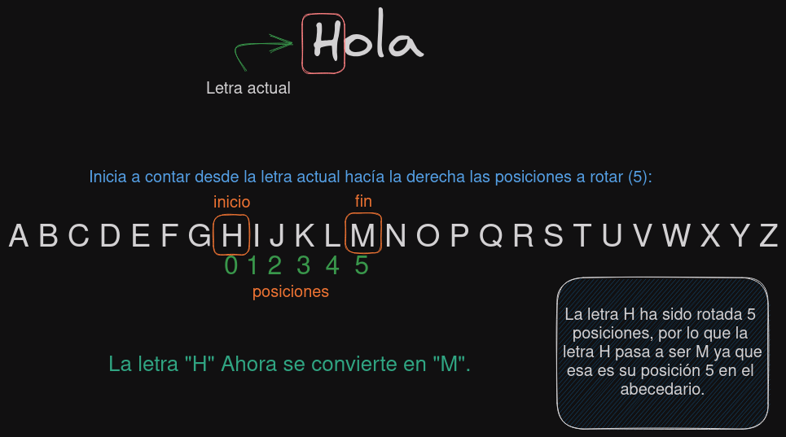

Si queremos decodificar el texto simplemente aplicamos todo al inversa, empezamos desde la letra **"M"** y contamos en reversa hasta llegar a 5, y podemos ver que es hasta la letra **"H_"** y repetimos el proceso para las siguientes letras

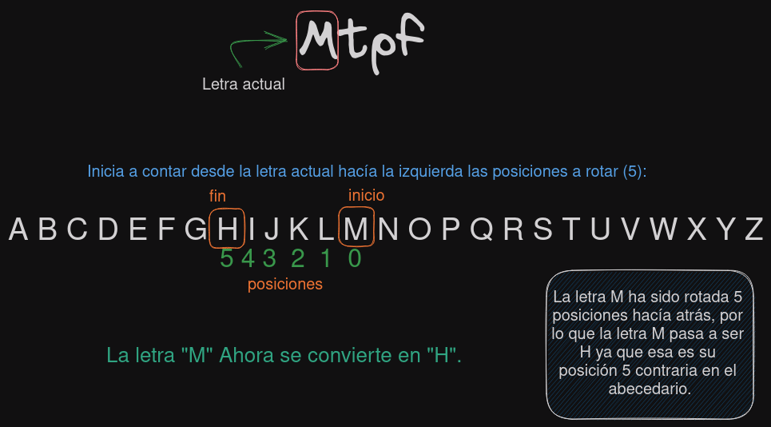


Bueno una vez entenido esto pasamos de nuevo a resolver el nivel 11.

Vamos a leer el contenido del archivo y hay que decodificarlo usando 13 posiciones, para automatizar esto y no hacerlo manualmente vamos a usar el comando `tr`.

##### ¿Qué es tr?

El comando tr (abreviatura de translate o transform) se utiliza para:

1. Traducir (reemplazar) caracteres de una entrada.
    * `echo "hola mundo" | tr 'a-z' 'A-Z'`
        * Salida: _HOLA MUNDO_
2. Eliminar caracteres específicos.
    * echo "hola mundo" | tr -d 'aeiou'
        * Salida: _hl mnd_
3. Reducir secuencias repetidas de un mismo carácter.
    * `echo "foo    bar" | tr -s ' '`
        * Salida: _foo bar_

El comando a utilizar es el siguiente:

```bash
cat data.txt | tr '[G-ZA-Fg-za-f]' '[T-ZA-St-za-s]'
```

Ahora quiero explicar que es exactamente los parametros del comando `tr`.

* `[G-ZA-Fg-za-f]`: Esto es el conjunto de caracteres que quiero traducir:
    
    * **Primera parte - Esto representa el alfabeto completo, pero reorganizado:**
        * `G-Z`: Todos los caracteres desde la 'G' hasta la 'Z'
        * `A-F`: Todos los caracteres desde la 'A' hasta la 'F'
            * [G-ZA-F] = A-Z rotado 6 posiciones hacia atrás (como una rotación circular)
[g-za-f] = a-z rotado 6 posiciones hacia atrás
            * Resultado: **_G H I J K L M N O P Q R S T U V W X Y Z A B C D E F_**
    * **Segunda parte** Este es el conjunto al que se traducirán los caracteres.
        * T-Z → letras desde la T hasta la Z
        * A-S → y luego desde A hasta la S
        
        Este conjunto está desplazado 13 letras atrás respecto al alfabeto original y de igual forma las letras minusculas.

Le damos enter y podemos observar la contraseña

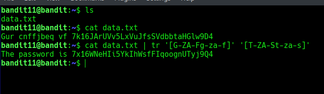


### Level 12 -> Level 13

En este nivel nos especifica que vamos a trabajar con un archivo hexdump, un hexdump es un archivo que se ha comprimido varias veces, entonces para este nivel nos pide crear un directorio en la ruta `/tmp` para poder mover el archivo a la carpeta creada, tambien indica que hay que cambiarle el nombre al archivo.

Entonces vamos a empezar un **hexdump** _(Volcado hexadecimal)_ es una visualizacion de los datos de un archivo. Si leemos el contenido del archivo tendremos lo siguiente:

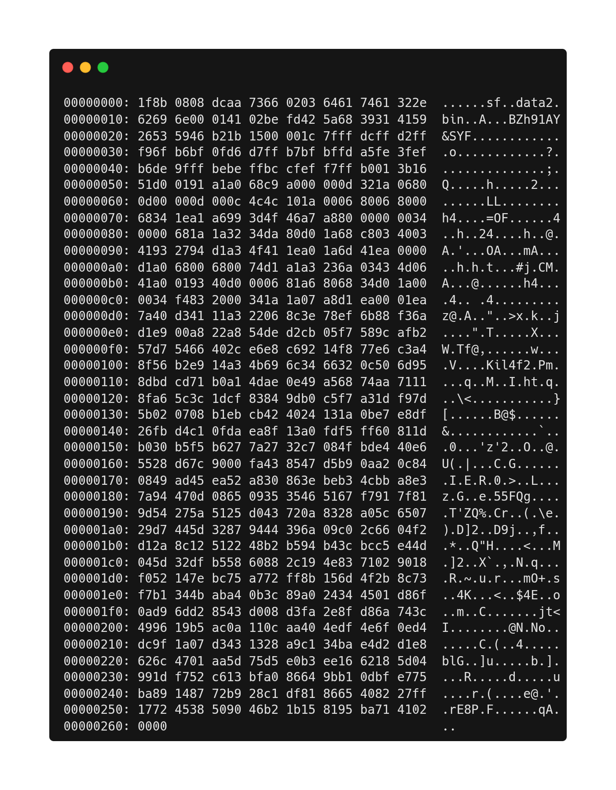

Para saber exactamente de que archivo se trata tenemos que verificar los magic numbers. Estos numeros magicos son bytes agrupados que indican el tipo al que pertenece un archivo, para encontrar los numeros magicos nos dirigimos a la primera linea del contenido del archivo, la cual es la siguiente:

```bash
00000000: 1f8b 0808 dcaa 7366 0203 6461 7461 322e  ......sf..data2.
```

Lo que nos indica con que archivo estamos lidiando es lo que sigue despues de los numeros '0', podemos observar que es `1f8b`, Si buscamos a que archivo pertenece este numero magico nos saldra que es de un archivo con formato gzip, lo que nos dice que se trata de un archivo con extencion `.gz``

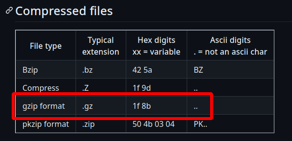

Una vez sabemos esto, nos dirigimos a la carpeta tmp donde nos copiaremos el archivo. Vamos a aplicarle el comando `xxd` con el parametro `-r`, quedando asi el comando: `cat data | xxd | xxd -r`

* El comando `xxd -r`: Convierte el contenido hexadecimal a su forma binaria original.

Por ejemplo: Nosotros tenemos esta cadena "Hola que tal" y le aplicamos el comando xxd nos permite ver la cadena en hexadecimal: 

`echo "Hola que tal" | xxd`

Pero ahora si hacemos 

`echo "Hola que tal" | xxd | xxd -r`

Nos tendira que revertir al texto original. Ahora si unicamente queremos quedarnos con la parte hexadecimal tendriamos que aplicarle otro parametro al comando xxd, el cual es el siguiente:

`echo "Hola que tal" | xxd -ps` 

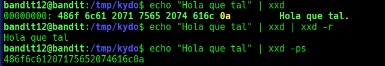

Ahora nos pasamos a nuestro archivo y lo primero que nos interesa es todo ese texto, entonces nos dirigimos a la ruta /tmp que fue donde creamos nuestra carpeta de trabajo para este nivel y copiamos ahi el archivo, lo vamos a copiar con la extencion **.hex**, quedando asi el comando: `cp ~/data.txt data.hex`.

Una vez hecho eso ejecutamos el comando `xxd -r data.hex` vamos a observar que nos dara simbolos raros y esto claramente no nos dice muy bien de que archivo se trata, entonces lo que vamos a hacer es migrar todo este output a un archivo y esto lo haremos de la siguiente manera: 

`xdd -r data.hex > data` 

Bien y ahora con el comando `file` vamos a verificar que tipo de arhcivo es, y como se puede ver se trata de un gzip,

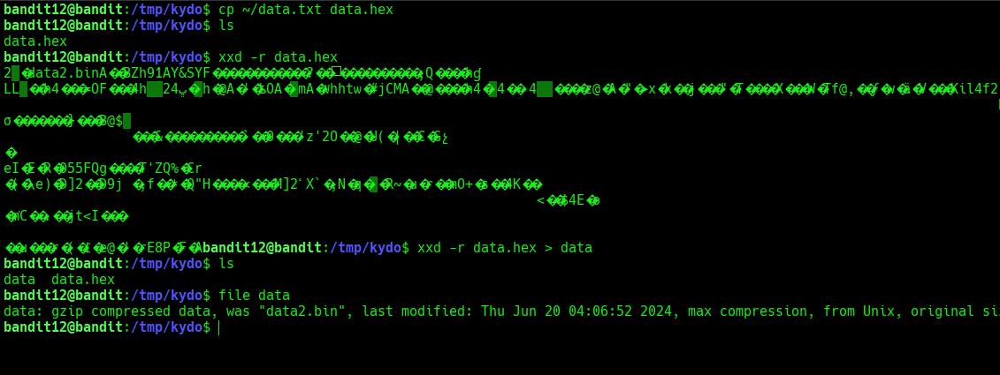

#### Instalacion de herramientas 7z y xxd

Lo que vamos a hacer a continuacion es usar el comando `7z`, esta herramienta nos permite descomprimir archivos ya que es universal, nos ahorramos escribir comandos como `tar-xf, gunzip, bzip2` etc. 

Y otra cosa importante es que 7z nos permite listar el contenido de un archivo comprimido, con el parametro 'l'. Una cosa a aclarar es que 7z no viene instalado en el servidor de over the wire, por lo que tendremos que migrar todo a nuestro entorno.

Si no tiene instalado 7z o xxd en su sistema pueden escribir el siguiente comando para inslarlo: 
* instalar 7z
    * Para sistemas basados en debian `sudo apt install 7z`.
    * Para sistemas basados en arch: `sudo pacman -S p7zip` 
* Instalar xxd
    * Para sistemas basados en debian `sudo apt install xxd`.
    * Para sistemas basados en arch: `sudo pacman -S tinyxxd`

Como en las intrucciones de over the wire se nos indica que un comprimido se comprimio varias veces pues vamos a automatizar el poceso de descomprimir los archivos esto para evitarnos hacer el mismo proceso para cada archivo manualmente.

#### Script para descomprimir archivos.

Bien una vez en nuestro entorno y ya con las herramientas instaladas, vamos a copiar el contenido antes visto y lo pegamos en un archivo con extencion ".hex", despues copiamos todo el output a otro archivo llamado "data", Una vez llegamos al mismo punto que en el servidor de over the wire empezamos con el script, 

Creamos el archivo usando `touch` y le damos permisos de ejecution con `chmod +x` y escribimos lo siguiente

```bash
#!/bin/bash/

name_decompressed=$(7z l data.gzip | grep "Name" -A 2 | tail -1 | awk 'NF{print$NF}')
7z x data.gzip > /dev/null 2>&1

while true; do
    7z l $name_decompressed > /dev/null 2>&1

    if [ $? -eq 0 ]; then
        decompressed_next=$(7z l $name_decompressed | grep "Name" -A 2 | tail -1 | awk 'NF{print$NF}')
        7z x $name_decompressed > /dev/null 2>&1 && name_decompressed=$decompressed_next
    else
        cat $name_decompressed
        exit 1
    fi
done
```

Aqui la explicacion de que hace cada linea de codigo:

* `name_decompressed=$(7z l data.gzip | grep "name" -A 2 | tail -1 | awk 'NF{print$NF}')`
    * `7z l data.gzip`: Es utilizado para listar el contenido del archivo con el parametro 'l'.
    
    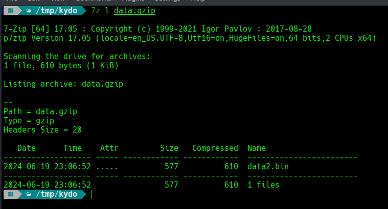

    * `grep "Name" -A 2`: Filtra las lineas que coniene la palabra "Name" y muestra ademas las dos lineas siguientes despues de encontrar la palabra "Name".

    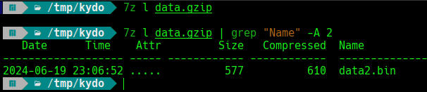
    
    * `tail -1`: Muestra la ultima linea de la salida generada por `grep`.

    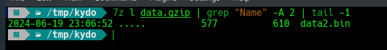

    * `àwk NF{print$NF}`: Se utiliza para imprimir el ultimo campo de las lineas, esto se usa para extraer el nombre del archivo siguiente a descomprimir.

    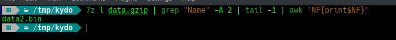

* `7z x data.gzip > /dev/null 2>&1`: Esta line adescomprime nuestro primer archivo
    * `> /dev/null 2>&1`: Redirige la salida estandar **STDOUT** al `/dev/null`, es STDOUT descarta cualquier output, añadiendo esta operacion `2>&1`, lo que hace que sea **STDERR**, antes habiamos usardo el estandar **STDOUT** que solo descarta los mensajes de errores porque colocabamos `2>/dev/null` que lo hace diferente.

* `while true; do`: inicia un bucle infinito el cual se cierra con `done`.

* `7z l "$name_descompressed" > /dev/null 2>&1`: Esta listando el contenido del primer archivo descomprimido

* `if [ $? -eq 0 ]; then`; Esta linea verifica el comando de salida ejecutado recientemente, para validar si es verdadero o falso.
    * `$?`: Es una variable en bash que contiene el ultimo codigo de estado, puede ser cero o uno.
    * `-eq 0`: Comprar que el codigo de salida sea igual a 0, en la mayoria de casos es un codigo de estado verdadero.

* `7z x "$name_decompressed" > /dev/null 2>&1 && name_decompressed=$decompressed_next`: Descomprime el archivo actual (`$name_decompressed`). Si la descompresión tiene éxito (comando retorna 0), actualiza name_decompressed con el nombre del próximo archivo descomprimido (`$decompressed_next`).

```bash
    else
        cat "$name_decompressed"
        exit 1
    fi
```
Si el comando `7z l "$name_decompressed"` no tuvo éxito (código de salida distinto de 0):
* `cat "$name_decompressed"`: Muestra el contenido del archivo descomprimido actual.
* `exit 1`: Termina el script con un código de salida 1, indicando un error.

Y asi es como podemos obtener la contraseña sin tener que descomprimir todos los archivos manualmente, procedemos a irnos al siguiente nivel.

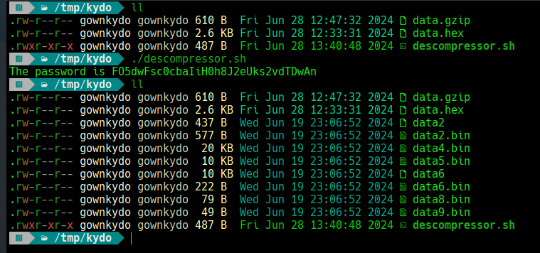

### Level 13 -> level 14

En este nivel se nos esta indicando que la contraseña esta guardada en la ruta `/etc/bandit_pass/bandit14`, pero esta contraseña solo puede leerla el usuario _"bandit14"_, entonces se nos dara una clave ssh para poder acceder como _bandit14_.

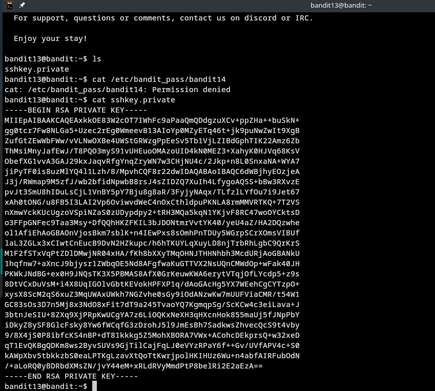

Entonces haremos lo siguiente:

`ssh -i sshkey.private bandit14@bandit.labs.overthewire.org -p 2220`

Nosotros ya sabemos que tenemos una clave ssh privada y con el comando que le acabamos de pasar le especificamos nos queremos conectar a el usuario bandit14 si tener que usar una contraseña, porque la llave privada generada ya actua como una contraseña para entrar como el usuario bandit14.

y haciendo esto vemos que accedemos como bandit14, entonces nos dirigimos al archivo y podremos ver la contraseña.

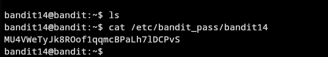

### Level 14 > Level 15

Este nivel se va a centar en conexiones por TCP, lo que nos dice en el este nivel es que la contraseña puede ser capturada proporcionando la contraseña del nivel actual por el puerto 30000 del localhost

Bueno entonces con eso nosotros ya identificamos que el puerto 30000 esta abierto y para comprobarlo vamos a lanzar una cadena por ese puerto:

`echo '' > /dev/tcp/127.0.0.1/30000`

Posterior a esto podemos ver que no nos devuelve nada y si imprimimos el codigo de estado podemos ver que nos da un codigo de estado exitoso, entonces confirmamos que el puerto esta abierto 

Ahora lo que vamos a hacer es mandarle la contraseña de nuestro usuario bandit14, ahora vamos a hacerlo, para esta ocacion usaremos el comando `nc`, quedando de la siguiente manera

`nc bandit.labs.overthewire.org 30000`

damos enter e ingresamos la contraseña y como podemos ver nos dara la contraseña.

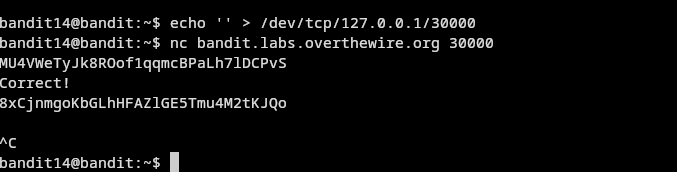

### level 15 --> level 16

Este nivel es parecido al nivel anterior, pero si probamos conectarnos por telenet tampoco nos dara el acceso, esto se debe a que ahora la comunicacion esta viajando por un protocolo de encriptacion.

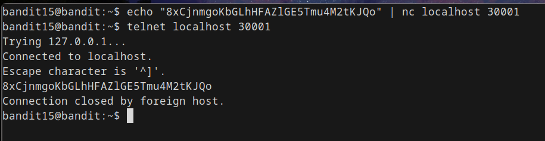

Entonces vamos a usar la biblioteca **openssl** para comunicaciones seguras a traves de redes, con una implementacion de protocolos criptograficos como por ejemplo usando **TLS**_(Transport Layer Security)_ y **SSL**_(Secure Sockets Layer)_

Usando openssl y revisando un poco la documentacion del mismo, vamos a usar el parametro s_client para conectarnos como clientes y no como si fueramos un servidor como lo haciamos por "telnet" o con "nc"

El comando es el siguiente: 

```bash
openssl s_client -connect localhost:30001
```

Explicacion del comando: 

1. **OpenSSL**: Nombre de la biblioteca y launcher de la misma para la biblioteca
2. **s_client**: Este es una implementacion SSL/TLS de una conexion tranparente como cliente para acceder a un servidor de manera remota hablando de igual forma SSL/TLS lo que hace que pueda entender lo que estamos mandando por este canal.
3. **-connect host:port**: Parametro de s_client para conectarnos usando un host y un puerto en especifico, si no establece el puerto tomara el de localhost por defecto.

Una vez que le demos enter veremos lo siguiente, en este espacio solo copiaremos y pegamos la contraseña del nivel 15 y nos tiene que devolver la contraseña del nivel 16. Y aqui es como terminamos el nivel 15!


### Level 16 --> level 17

Para este nivel vamos a utilizar la herramienta de **nmap**, y explicare cuales son las indicaciones para resolver este nivel

1. **Buscar puertos abiertos**: Hay un rango de puertos (del 31000 al 32000) en los que necesitas comprobar si alguno tiene un "servidor" funcionando que esta en espera de recibir conexiones.

2. **Identificar los que usan SSL/TLS**: Una vez que encuentres los puertos que tienen un servidor escuchando, el siguiente paso es identificar cuáles usan una conexión segura (SSL/TLS) y cuáles no.

3. **Encontrar el servidor correcto**: Solo uno de esos servidores te va a dar las credenciales para el siguiente nivel. Los demás simplemente van a devolverte lo mismo que les envíes, como si te estuvieran ignorando.


#### ¿Que es nmap?

Nmap permite a los administradores de red encontrar qué dispositivos se están ejecutando en su red, descubrir puertos y servicios abiertos y detectar vulnerabilidades.

Primero, Nmap te ayuda a mapear rápidamente una red sin comandos ni configuraciones sofisticados. También admite comandos simples (por ejemplo, para verificar si un host está activo) y secuencias de comandos complejas a través del motor de secuencias de comandos Nmap.

Otras características de Nmap incluyen:

1. Capacidad para reconocer rápidamente todos los dispositivos, incluidos servidores, enrutadores, conmutadores, dispositivos móviles, etc. en redes únicas o múltiples.
2. Ayuda a identificar los servicios que se ejecutan en un sistema, incluidos los servidores web, los servidores DNS y otras aplicaciones comunes. Nmap también puede detectar versiones de aplicaciones con una precisión razonable para ayudar a detectar vulnerabilidades existentes.
3. Nmap puede encontrar información sobre el sistema operativo que se ejecuta en los dispositivos. Puede proporcionar información detallada, como las versiones del sistema operativo
4. Durante la auditoría de seguridad y el escaneo de vulnerabilidades, puedes usar Nmap para atacar sistemas usando scripts existentes del motor de scripting de Nmap.

Una vez ya sabiendo esto nos vamos a pasar a la practica, para ello vamos a escribir el siguiente comando:

```bash
nmap --open -T5 -n -v -p31000-32000 127.0.0.1
```

Ahora procedemos a la explicacion del comando:

* **nmap** — herramienta que hace el escaneo
* **--open** — solo muestra los puertos que están abiertos
* **-T5** — le dice a nmap que vaya muy rápido. Útil para ahorrar tiempo, pero puede ser más ruidoso.
* **-n** — evita resolver nombres de dominio; usa solo direcciones IP para ir más rápido.
* **-v** — modo verboso, te da información adicional mientras escanea.
* **-p31000-32000** — el rango de puertos que queremos revisar.
* **127.0.0.1** — la dirección localhost (tu propia máquina), es decir, escanea en el equipo donde estás trabajando.

Entonces nos dara el siguiente resultado:

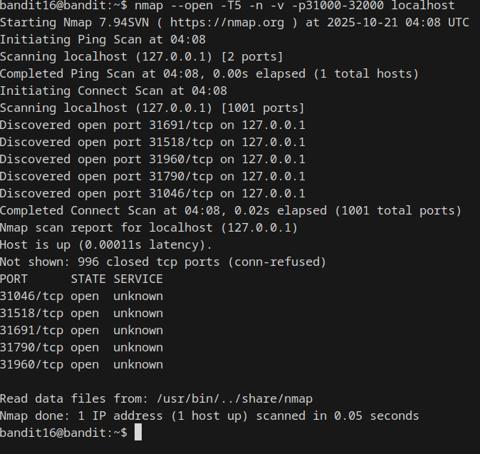

Ahora para esta parte debemos de tomarlo de forma aleatoria y para ello vamos a hacerlo usando el comando **ncat** y tener la contrasela de bandit 16, si no la tienes copiada y no recuerdas cual era, simplemente lee el archivo que esta en esta ruta: `/etc/bandit_pass/bandit16`, aqui es a la suerte y deberas escoger el puerto que se vea mas convincente o puedes probar uno por uno

Comando: `ncat --ssl localhost 31790`

En este caso lo encontramos y le damos la contraseña de bandit 16 y podemos notar que nos devuelve una llave privada, por lo tanto tendremos que usarla con **ssh**

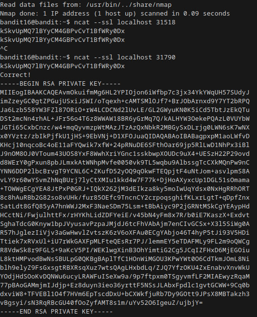

Bueno ahora nos vamos a crear una carpeta temporal, por lo tanto nos dirigimos a la ruta **/tmp/** y creamos una carpeta y dentro un archivo con la extencion **.key**, procedemos asignarle permisos **700** y ahora estamos listos para poder acceder al bandit 17 usando ssh

> building . . .
