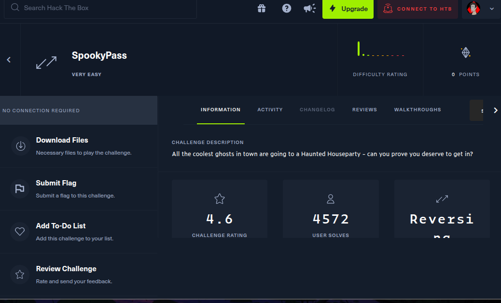
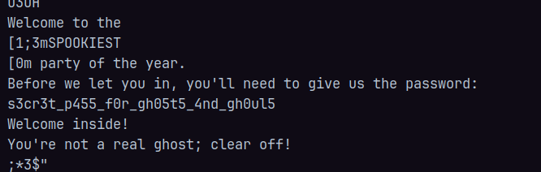
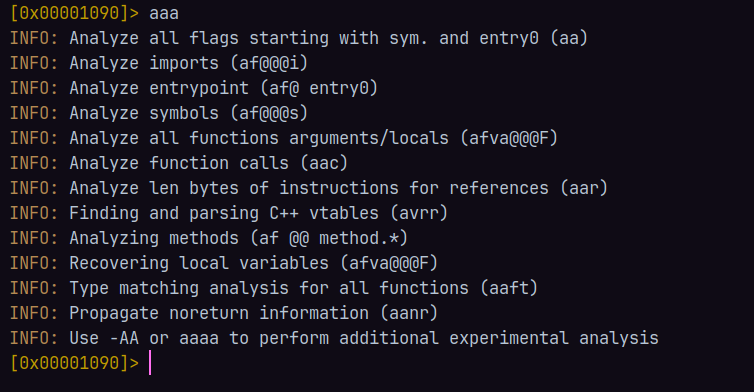
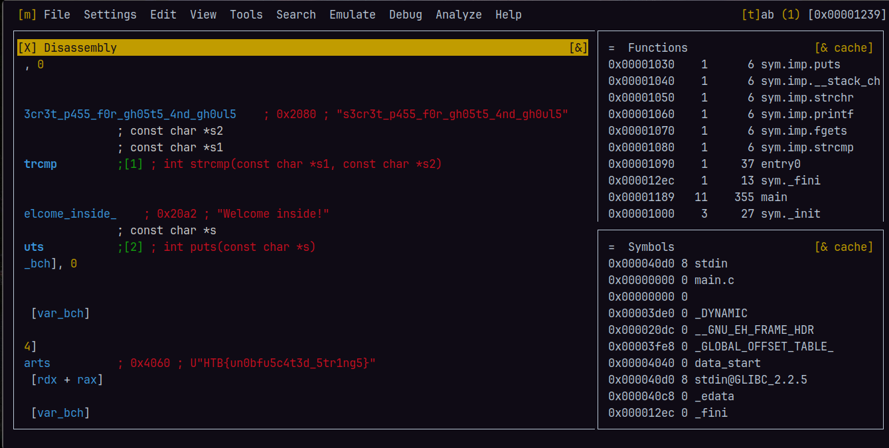

+++
title = "Reversing Básico con SpookyPass"
description = "En este reto de SpookyPass, con un simple comando podrás desvelar el misterio de la contraseña secreta."
date = 2025-05-17
categories = [
    "Bash",
    "Hack The Box",
    "Ciberseguridad",
    "Sistemas Operativos"
]
tags = [
    "Reversing",
    "strings",
    "Binarios",
    "CTF",
    "Hack The Box",
]
image = "htb.png"
+++



La maquina SpookyPass trata de reversing, de manera muy sencilla pordemos usar el comando ``strings``

El comando ``strings`` nos servira para identificar las cadenas de texto en un binario, podemos, si la contraseña no esta cifrada, podremos ver cual es a travez del uso de este comando.

Entonces para resovler esta maquina simplemente ejecutamos el binario usando el comando `strings pass` y en algun punto encontraremos el siguiente texto: **s3cr3t_p455_f0r_gh05t5_4nd_gh0ul5** 



### Forma 2 de resolver el problema usando radare2

Tambien usando el tool **radares2**, podemos investigar el binario **"pass"**, para descargar este tool simplemente usamos:

```bash
sudo apt install radare2
sudo pacman -S radare2
```

con este tool vamos a poder ver todo lo que hay por detras, usando radare2 nos dara un prompt, por lo que vamos a escribir `aaa`, para comenzar a analizar el binario, nos dara este output:



Una vez que hemos analizado el archivo, simplemente ponemos `v` para movernos a la vista y esto es lo que nos mostrara



Una vez aqui solo es cuestion de bajar y buscar donde se encuentran las cadenas de texto, como por ejemplo el "Welcome inside".

Podemos notar que incluso usando radare2 podemos encontrar la flag una vez que estamos dentro.

Y asi es como solucionamos la maquina.

### Referencias

[Comandos Basicos para radare2](https://github.com/radareorg/radare2/blob/master/doc/intro.md)
