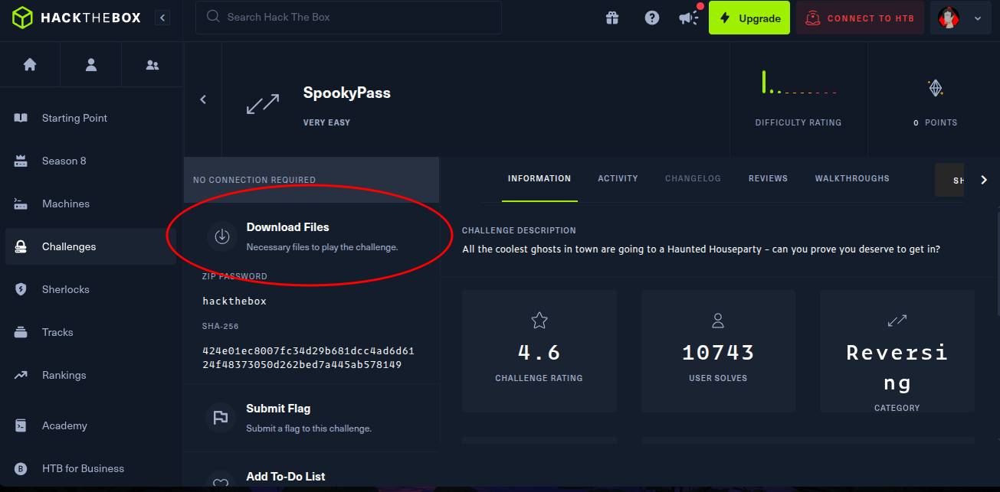
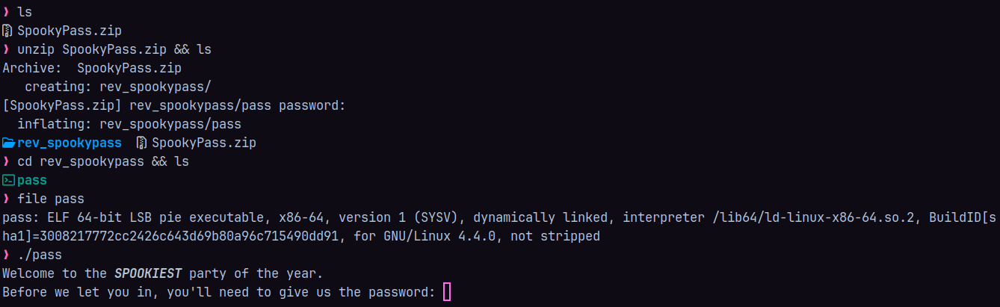

+++
title = "Hack The Box SpookyPass Challenge - Writeup"
description = "El desafío “SpookyPass” de Hack The Box es una tarea de ingeniería inversa muy fácil, en la que debes analizar un ejecutable para encontrar la contraseña correcta y obtener acceso."
date = 2025-05-17
categories = [
    "Bash",
    "Hack The Box",
    "Ciberseguridad",
    "Sistemas Operativos"
]
tags = [
    "Reversing",
    "strings",
    "Binarios",
    "CTF",
    "Hack The Box",
    "chellenge",
]
image = "htb.png"
+++


La maquina SpookyPass trata de reversing, pero y ¿Que es el reversing?.

Bueno el reversing en ciberseguridad, también conocido como ingeniería inversa, es el proceso de analizar y descomponer un software o hardware con el objetivo de comprender su funcionamiento interno, identificar posibles debilidades o incluso descubrir cómo puede ser vulnerado.

Ahora bien, la maquina nos proporciona un archivo que podemos descargar, vamos a descargarlo y lo movemos a una carpeta de trabajo para resolver este ejercicio mas comodamente.



Una vez tengamos el archivo vamos a ver de que se trata, y como es un archivo ejecutable procedemos a ejecutar el archivo.



Cuando ejecutas el binario proporcionado, se muestra un mensaje solicitando una contraseña. 

El objetivo es analizar el programa para descubrir la contraseña correcta. Esto normalmente implica técnicas como inspeccionar el binario en busca de cadenas codificadas, analizar la lógica del programa usando herramientas como Ghidra o IDA, o depurar el ejecutable para rastrear su comportamiento. 

El desafío está diseñado para ser sencillo, lo que lo convierte en un excelente punto de partida para quienes están aprendiendo ingeniería inversa, entonces para ello usaremos el comando **strings**.

El comando ``strings`` nos servira para identificar las cadenas de texto en un binario, podemos, si la contraseña no esta cifrada, podremos ver cual es a travez del uso de este comando.

Entonces para resovler esta maquina simplemente ejecutamos el binario usando el comando `strings pass` y en algun punto encontraremos el siguiente texto: **s3cr3t_p455_f0r_gh05t5_4nd_gh0ul5** 


### Forma 2 de resolver el problema usando radare2

Tambien usando el tool **radares2**, podemos investigar el binario **"pass"**, para descargar este tool simplemente usamos:

```bash
sudo apt install radare2
sudo pacman -S radare2
```

con este tool vamos a poder ver todo lo que hay por detras, usando radare2 nos dara un prompt, por lo que vamos a escribir `aaa`, para comenzar a analizar el binario, nos dara este output:


Una vez que hemos analizado el archivo, simplemente ponemos `v` para movernos a la vista y esto es lo que nos mostrara


Una vez aqui solo es cuestion de bajar y buscar donde se encuentran las cadenas de texto, como por ejemplo el "Welcome inside".

Podemos notar que incluso usando radare2 podemos encontrar la flag una vez que estamos dentro.

Y asi es como solucionamos la maquina.

### Referencias

[Comandos Basicos para radare2](https://github.com/radareorg/radare2/blob/master/doc/intro.md)
