+++
title = 'Over The Wire (Bandit) - Parte 1'
description = "Los Juegos de guerra que ofrece la comunidad OverTheWire pueden ayudarte a aprender y practicar conceptos de seguridad informatica o conceptos basicos de una forma divertida."
date = 2025-08-05
categories = [
    "Linux",
    "Bash",
    "Tutorial",
    "Comandos",
]
tags = [
    "Linux",
    "Bash",
    "Comandos",
    "Terminal",
    "Guía",
    "Productividad",
    "Desarrollo",
    "Retos",
]

image = "wallpaper.png"
+++

## Que es **Over The Wire**?

OverTheWire es una comunidad que ofrece wargames, es decir, juegos diseñados para enseñar y practicar habilidades relacionadas con la seguridad informática. A través de retos interactivos, puedes aprender desde conceptos básicos hasta técnicas más avanzadas, todo de una manera práctica y entretenida.

En esta primera parte, resolveremos los primeros 10 niveles del wargame Bandit. La idea es no sobrecargarte con demasiada información y enfocarnos en aplicar diferentes métodos para superar cada desafío, comenzando desde el nivel 0 y avanzando paso a paso.

Puedes acceder al juego desde el siguiente enlace:
👉 **[OverTheWire](https://overthewire.org/wargames/bandit/) - Bandit**

Lo que te llevará a la siguiente pantalla:

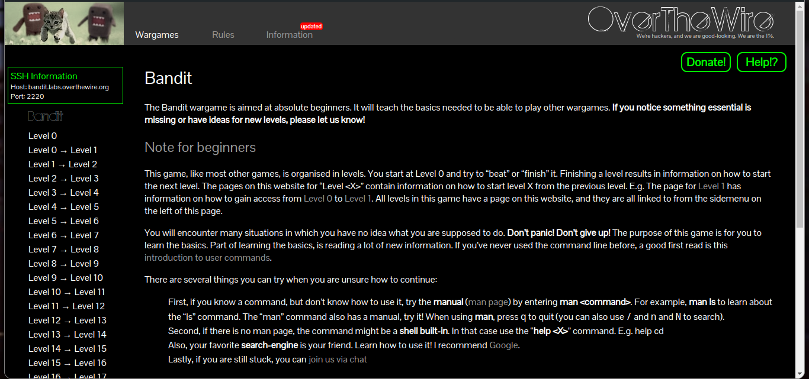

Y aqui es donde empieza nuestro aprendizaje, empecemos!.

### Level 0 -> Level 1

Nos dirigiremos al nivel 0, donde podemos ver las instrucciones para acceder como bandit0 y conectarnos al servidor usando SSH. 

Una vez en el nivel cero podemos observar que hay un cuadro verde justo debajo del gato, eso de ahi es el nombre del host al que nos uniremos y el puerto donde esta

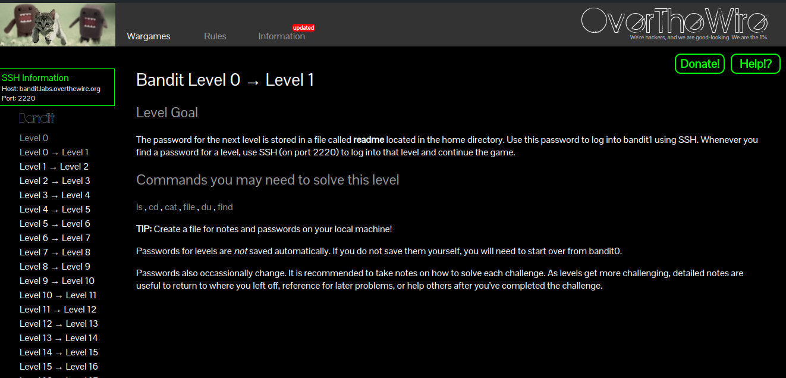

Para poder empezar a resolver estos puzles vamos a usar el siguiente comando:

```bash
ssh bandit0@bandit.labs.overthewire.org -p 2220
```

Si es nuestra primera vez usando el comando ssh, nos preguntará si estamos seguros de acceder al servidor. Entonces, escribimos 'Y/y' o simplemente "yes". A continuación, nos pedirá la contraseña del usuario bandit0, la cual es **bandit0**.

Una vez dentro del servidor, comprobamos que somos el usuario bandit0 con el comando `whoami`. Este comando nos sirve para saber qué usuario está usando el sistema actualmente y, si todo está bien, podemos observar claramente que se trata del usuario "bandit0". 

Posteriormente, escribimos el comando `ls` para listar el contenido de nuestro directorio home y ahí es donde se encuentra el archivo "_readme_" que contiene la contraseña para acceder a "bandit1". 

Escribimos el comando `cat readme` para leer el contenido de este archivo y, como se puede observar, esa es la contraseña para el siguiente nivel, la copiamos en nuestro portapapeles y salimos del servidor con el comando `exit`.

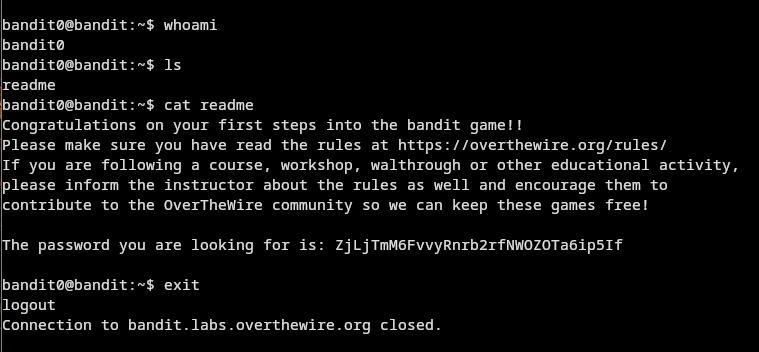

### Leven 1 -> level 2

Para el siguiente nivel, vamos a acceder como **bandit1**. Vamos a usar el mismo comando que usamos anteriormente con bandit0, pero cambiando el usuario. 
El comando es el siguiente: 

`ssh bandit1@bandit.labs.overthewire.org -p 2220`. 

La única diferencia será el número del usuario, todo lo demás se mantiene igual y asi sera mientras vayamos subiendo de nivel. 

Accedemos al usuario de bandit1 y una vez que nos pida la contraseña pegamos la que habíamos guardado anteriormente. Y las instrucciones para el siguiente nivel son las siguientes.

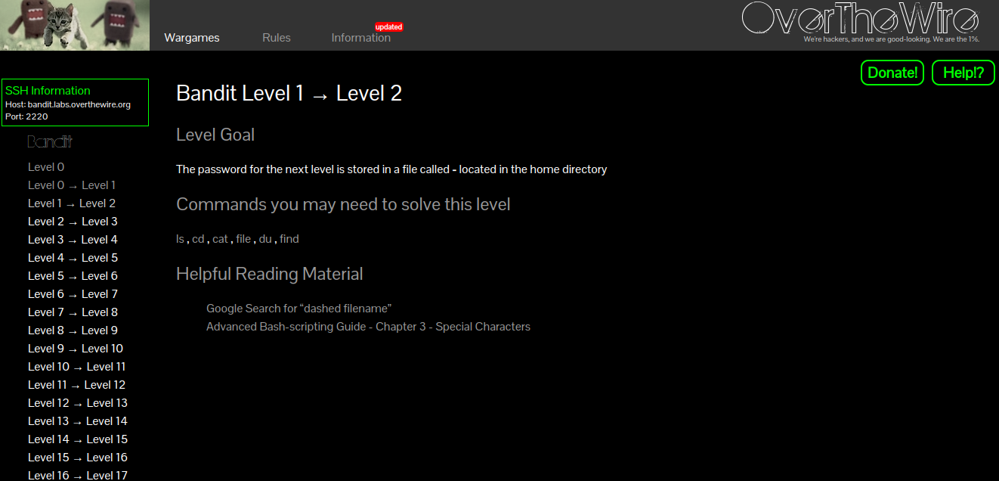


Nos especifica que la contraseña está guardada en un archivo localizado en el directorio home con el nombre: **'-'**.

El desafío parece simple, pero el problema surge cuando escribimos el comando `cat -`. Este se queda en espera, ya que lo toma como si fuera un parámetro de `cat`. Entonces, ¿cómo solucionamos esto? Para poder resolver este desafío, podemos hacerlo de varias formas:

1. **Desde la ruta absoluta:** `cat /home/bandit1/-`. De esta forma, indicamos la ruta completa del archivo, evitando que `cat` lo confunda con un parámetro.

1. **Forma alternativa de usar la ruta absoluta:** `cat $(pwd)/-`. Usando este método, nos ahorramos escribir toda la ruta. El comando `pwd` nos da la ruta actual en la que estamos y si lo combinamos con los caracteres especiales `$()`, toma el output del comando `pwd`, para que asi el comando `cat` interprete la ubicación donde estamos y ya solo hace falta poner el nombre del archivo que queremos leer.

2. **Indicando la ruta actual:** `cat ./-`. De esta forma le indicamos que queremos leer un archivo desde la ruta actual en la que nos encontramos (representada por un punto), y posteriormente escribmos el nombre del archivo que queremos leer.

Y podemos observamos que de cualquiera de estas maneras obtenemos la contraseña.

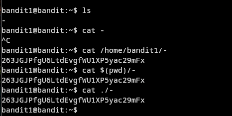

### Level 2 - Level 3

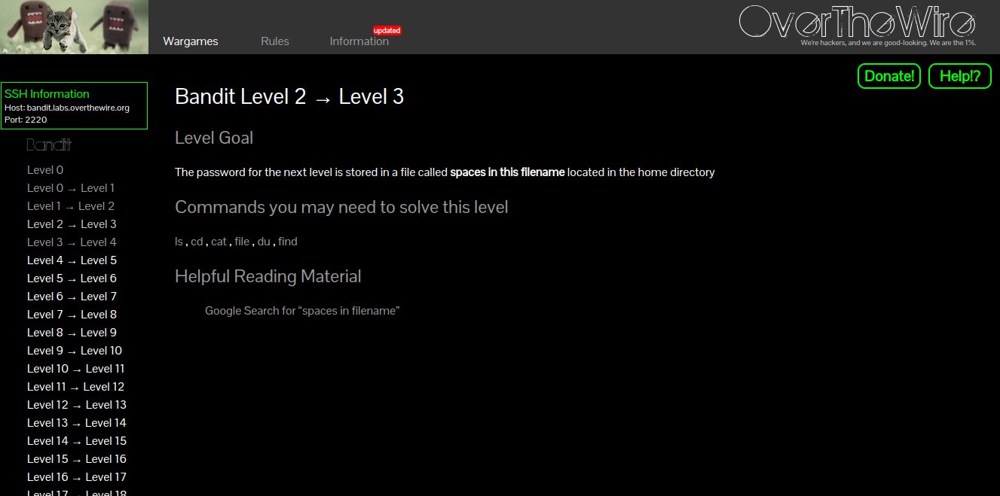

Para este nivel la contraseña esta guardada en un archivo oculto dentro del directorio "inhere"

Este nivel es muy simple, si listamos el contenido de la carpeta con el comando `ls`, sabremos que a simple vista no se puede ver ningun archivo, para ello vamos a hacer uso de los parametros de dicho comando, usaremos el parametro `-a` para listar todo lo que se encuentre dentro del directorio quedando asi el comando: `ls -a inhere`. Y ahora podemos observar que hay un archivo con el nombre "...Hiding-From-You", con el comando cat revisamos el contenido y tendremos la contraseña.

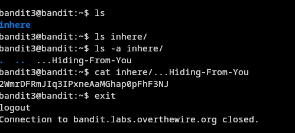

### Level 4 -> level 5

Para este nivel, se nos indica que la contraseña está guardada en un archivo humanamente legible, dentro del directorio "inhere".

Si listamos el contenido del directorio, podemos notar que hay múltiples archivos con distintos nombres. Dado que no todos tienen contenido legible y para evitar abrir e inspeccionar uno por uno, vamos a identificar el archivo correcto con el comando `file`, `xargs` y el comando `find`.

El comando `file` nos permite saber la clasificación de cada archivo: si es una imagen, un archivo de texto, un binario, un video etc. 

El comando `find` es una alternativa al comando `ls`, con la diferencia de que `find` busca desde la raíz de la ruta que se le pase. Por ejemplo, si escribimos el comando `find inhere`, este nos listará el contenido en forma de lista usando un formato de árbol binario.

El comando `xargs` lee los argumentos desde la entrada estándar. 

`echo "file1.txt file2.txt file3.txt" | xargs touch`

Esto creará los archivos `file1.txt`, `file2.txt`, y `file3.txt`

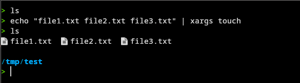

Lo que estamos haciendo es lo siguiente: dada la salida del comando `echo`, queremos crear archivos con el nombre de dicha salida. Entonces, se ejecuta `xargs touch` y el resultado es que se crean tres archivos con los nombres `file1.txt`, `file2.txt` y `file3.txt`.

Usando el carácter "or/pipe" `|`, que es un carácter especial, se puede hacer que la salida de un comando sea la entrada de otro comando. En el ejemplo anterior la salida del comando `echo` se vuelve la entrada del comando siguiente, en este caso del comando `touch`.

Bien, una vez explicado esto, utilizamos lo que sabemos con el comando `find`. Vamos a ejecutar la siguiente instrucción: `find . | xargs file`. Usamos el punto `.` en el comando `find` para especificar que queremos que busque archivos desde la ruta en la que estamos.

Si seguimos los pasos hasta aquí, ya tendremos listados todos los archivos y notamos que hay uno que es de tipo ASCII. Es el único dentro del directorio `inhere`. Por lo tanto, abrimos ese archivo con el comando `cat` y observamos que contiene la contraseña para el siguiente nivel.

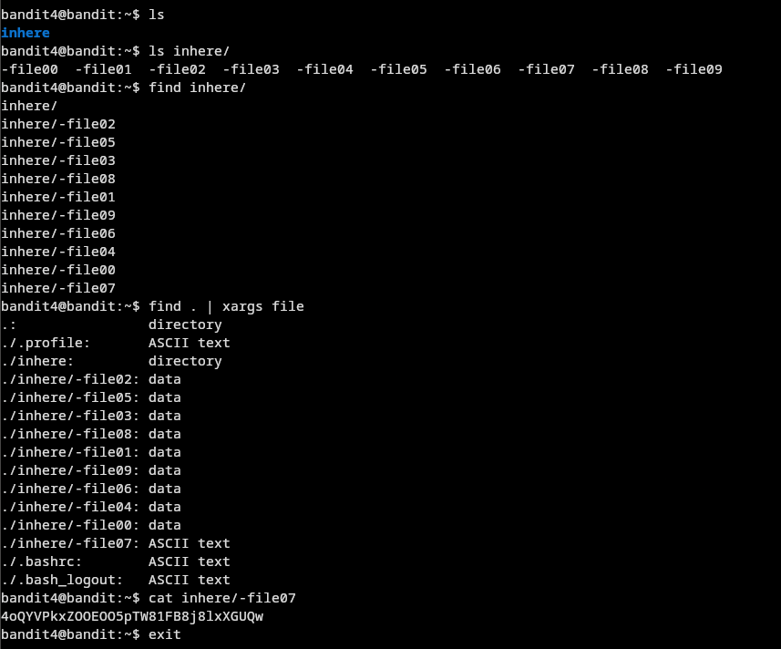

> _"¡Hay muchas maneras de resolver este nivel! Prueba usando comandos como find, xargs, cat o rutas absolutas. ¿Puedes encontrar más?"_

### Level 5 -> level 6

Para este nivel, las instrucciones mencionan que el archivo que guarda la contraseña está en algún lugar dentro del directorio "inhere" y tiene las siguientes propiedades:

- Es humanamente legible.
- Tiene un tamaño de 1033 bytes.
- No es un archivo ejecutable.

Vamos a usar el comando `find`, ya que este comando tiene parámetros que nos pueden ayudar a encontrar el archivo siguiendo estas propiedades.

El comando que vamos a utilizar es el siguiente:

`find inhere/ -readable -size 1033c ! -executable`.

* El parámetro `-readable` busca un archivo que sea legible(permisos de lectura). 
* Con el parámetro `-size` especificamos que sea de un determinado tamaño; puede ser en megas, gigas, bytes etc. Y en esta ocasión es en bytes, por lo tanto, se usa la letra 'c' _(Cada tamaño tiene una letra en especifico, puedes encontrarla en el manual page del comando find)_. 
* El carácter de exclamacion `!` es para negar una condición, así que especificamos que no queremos que sea ejecutable. Si quitamos el signo de exclamación, le estamos indicando que queremos que sea ejecutable.

Al ejecutar el comando, podemos ver que nos da un output de un archivo en la carpeta "_maybehere07_", dentro del archivo "_.file2_". Entonces, tenemos varias formas de leer este archivo.

* Usando el comando `cat` vamos a tomar el output del comando `find` como lo haría un chad promedio y el comando es el siguiente:

`cat $(find inhere/ -readable -size 1033c ! -executable)`

* Usando el comando `cat` de manera "normal" es el siguiente:

`cat inhere/maybehere07/.file2`

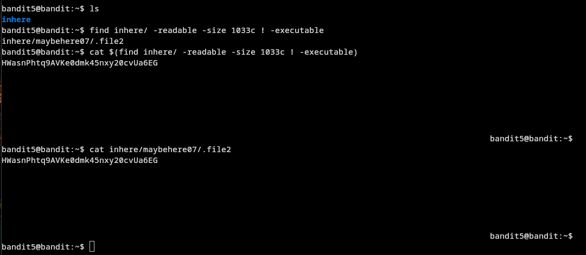

Ambas maneras nos daran la contraseña, pero de igual forma puedes seguir buscando mas alternativas y jugar con lo que hemos aprendido para tener un formato mas limpio de la contraseña, como se ve a continuacion.

Una vez obtuvimos la contraseña nos vamos para el siguiente nivel. 

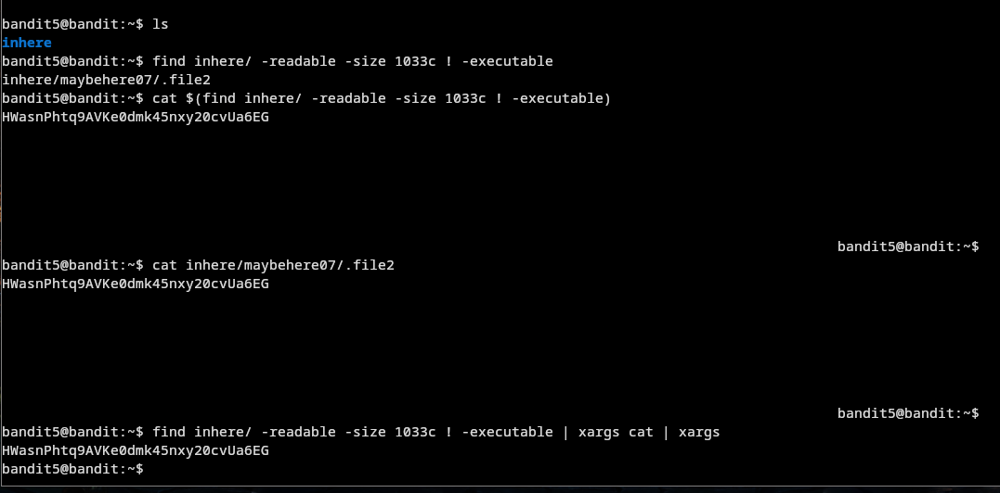 

### Level 6 -> level 7

Las instrucciones de este nivel son bastante similares a las del nivel anterior. Nos indican que la contraseña está guardada en algún lugar dentro del servidor. Por lo tanto, el archivo donde se encuentra la flag para el siguiente nivel tiene las siguientes propiedades:

* **El propietario es bandit7.**
* **Pertenece al grupo bandit6.**
* **Tiene un tamaño de 33 bytes.**

Una vez entendemos esto, vamos a usar el comando find con los siguientes parámetros:

* `-group`: para especificar el grupo al que pertenece el archivo.
* `-user`: seguido del nombre del propietario del archivo.
* `-size`: para especificar el tamaño del archivo, añadiendo una 'c' al final para indicar que estamos buscando en bytes.

El comando nos quedaría de la siguiente forma:

`find / -user bandit7 -group bandit6 -size 33c`

Una vez que presionamos Enter, observaremos que la pantalla se llenará de archivos que no podemos abrir, mostrando el mensaje "_Access denied_". 

Para filtrar estos accesos denegados, vamos a modificar nuestro comando agregando una instrucción al final: `2>/dev/null`.

Esta instrucción redirige los mensajes de error al `/dev/null`, veanlo como un agujero negro, se va al vacio, evitando que se muestren en la pantalla.

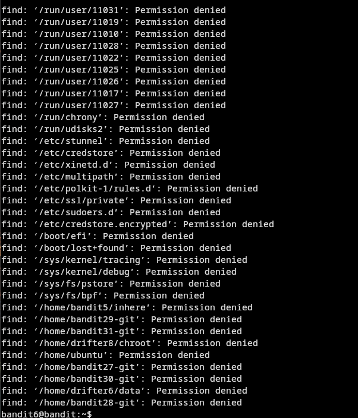


El comando completo es el siguiente:

`find / -user bandit7 -group bandit6 -size 33c 2>/dev/null`

dandonos como resultado el archivo que buscabamos, simplemente le hacemos un `cat` a la ruta o pueden hacerlo con `xargs cat`. Y nos vamos para el siguiente nivel.


### Level 7 -> level 8

Este nivel es muy simple, para esta parte ya pasamoa a la busqueda dentro de archivos, por lo que el nivel nos lo da entender en las instrucciones y se especifica que la contraseña esta almacenada dentro de un archivo llamado "_data.txt_" como pista tambien se nos indica que la palabra "**_millionth_**" esta antes de la contraseña, entonces para completar este nivel vamos a usar el comando `grep`.

* `grep`: el comando grep es muy utili cuando queremos filtar informacion dentro de un archivo.

Entonces una vez dentro de bandit7, vamos a escribir el siguiente comando:

`grep "millionth" data.txt`

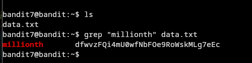

Y como podemos ver, tenemos la contraseña. Tambien podemos especificar la linea en la que se encuentra con el ṕarametro `-n`, pero para esta ocacion vamos a usar `awk` para unicamente filtrar por la contraseña, quedando asi el comando:

`grep "millionth" data.txt | awk '{print$2}'`

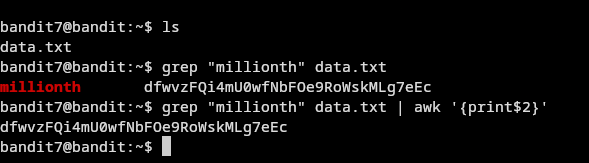

El numero `{print$2}`, se usa para especificar un argumento, en este caso el output del comando grep tiene dos textos, por lo tanto le estamos filtrando por el segundo texto, el cual es tomando como un argumento.

Inlcuso podemos modificar el comando de `awk` para imprimir uncamente el ultimo argumento, el comando es el siguiente:

`grep "millionth" data.txt | awk 'NF{print$NF}'`

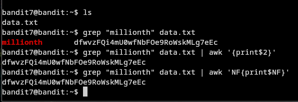

Y nos da el mismo resultado que el anterior, la unica diferencia es la instruccion que le estamos pasando, en este ultimo comando queremos que nos imprima el ultimo argumento de la oracion y con el anterior comando unicamente el segundo argumento. 

Si existieran mas palabras despues de la contraseña seria mas optimo usar el anterior comando especificando donde se encutra el texto por el cual queremos filtar.

Nos pasamos al siguiente nivel.

### Level 8 -> level 9

Para este nivel nos indica que la contraseña esta guardada en el archivo "_data.txt_" y nos indica que es la unica linea que no se repite.

Si nosotros verificamos el contenido que hay dentro vamos a observar que nada tiene sentido no podemos saber cual es la contraseña, entonces lo que vamos a hacer es usar el comando `uniq` combinado con el comando `sort`.

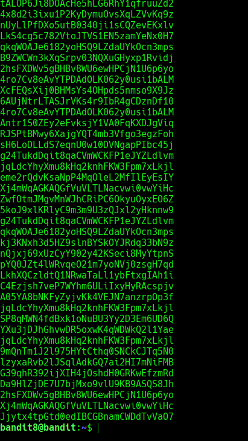

El comando `sort`: nos va a permitir ordenar las lineas, lo toma en cuenta en cuestion de la primera letra, si es un numero con el numero 0, si es letra con la letra 'a'

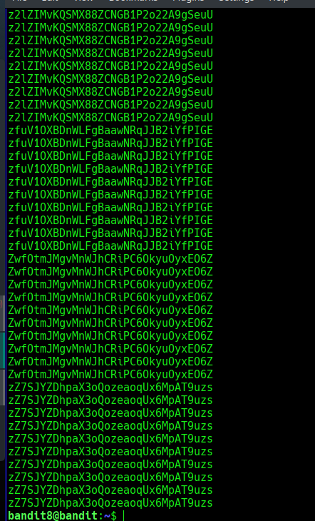

El comando `uniq`: nos ayudara a saber cual es la unica letra que no se repite en el texto.

Este es el comando que vamos a utilizar:

`sort data.txt | uniq -u`

dando la contraseña en cuestion y nos pasamos al siguiente nivel.

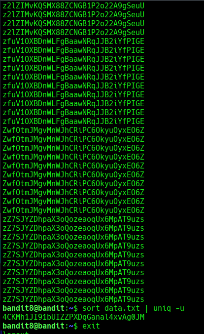

### Level 9 -> level 10

Para este nivel nos indica que la contraseña se encuentra almacenada en un archivo "_data.txt_" y la contraseña se encuentra ubicada seguida de las unicas palabras que son humanamente legibles.

Lo que nos dice esto es que si leemos el contenido del archivo lo que vamos a encontrar es texto que no se entiende, entonces lo que vamos a hacer es usar el comando `strings`:

Contenido del archivo:

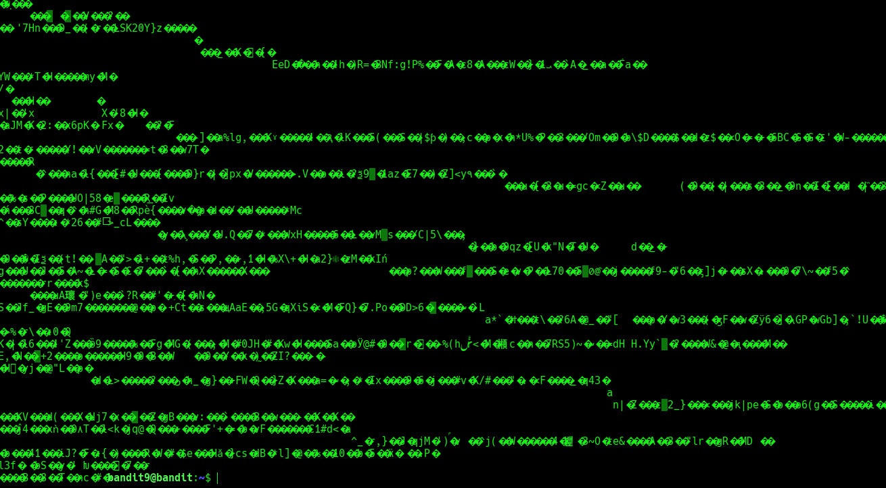

`strings`: Este comando nos listara todas las partes del archivo que son texto.

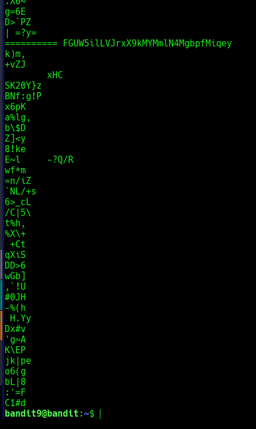

Podemos ver que nos ha filtrado las cadenas que son de texto, y aunque en su mayoría no se entiende, el nivel nos decia, que la contraseña estaba a un lado de los signos de igual, así que filtraremos con grep las lineas que tengan simbolos de igual:

`strings data.txt | grep "===="`

Vemos que nos a dado la contraseña, pero de igual manera podemos aplicar mas modificaciones a nuestro comando para obtener un texto mas claro y simplemnte sea la contraseña, por ejemplo:

Usando el comando `string data.txt | grep "====" | tail 1` hacemos que unicamente nos de la parte de de la ultima linea, ahora tambien haciendo esto podemos jugar de nuevo con el comando `awk` con el uso de parametros, entonces vamos a decirle a agregarle a nuestra salida que unicamente queremos el ultimo parametro que es donde se encuentra la contraseña, quedando asi el comando: 

`string data.txt | grep "====" | tail -1 | awk 'NF{print$NF}'`

Y esto nos dara la contraseña.

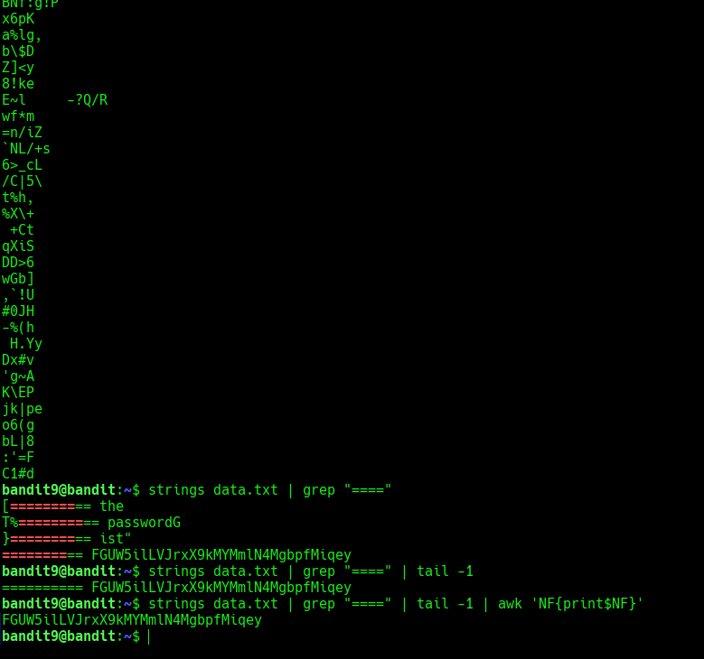


> flag _(checkpoint)_: FGUW5ilLVJrxX9kMYMmlN4MgbpfMiqey


### Level 10 -> level 11

Ahora este nivel es bastante facil ya que unicamente nos indica que hay que decodificar un archivo que contiene texto en base64, por lo tanto unicamente vamos a utilizar el comando `base64 -d`, el parametro -d quiere decir "decode"

por lo tanto el el comando seria el siguiente:

`cat data.txt | base64 -d`

Y como podemos ver tenemos la contraseña y nos dirigimos al siguiente nivel.


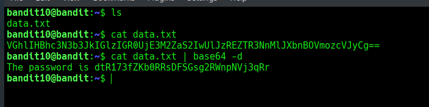


> _**Recomiendo descansar aca e iniciar de nuevo desde el nivel 0 para intentar nuevas maneras de acceder a los niveles y reforzar lo aprendido. Nos vemos en el proximo post!!.**_

